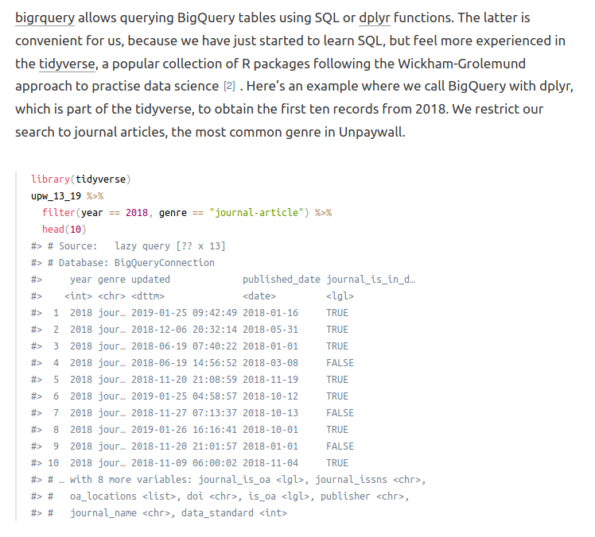
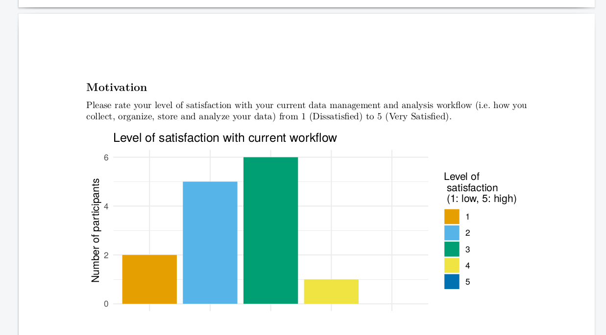
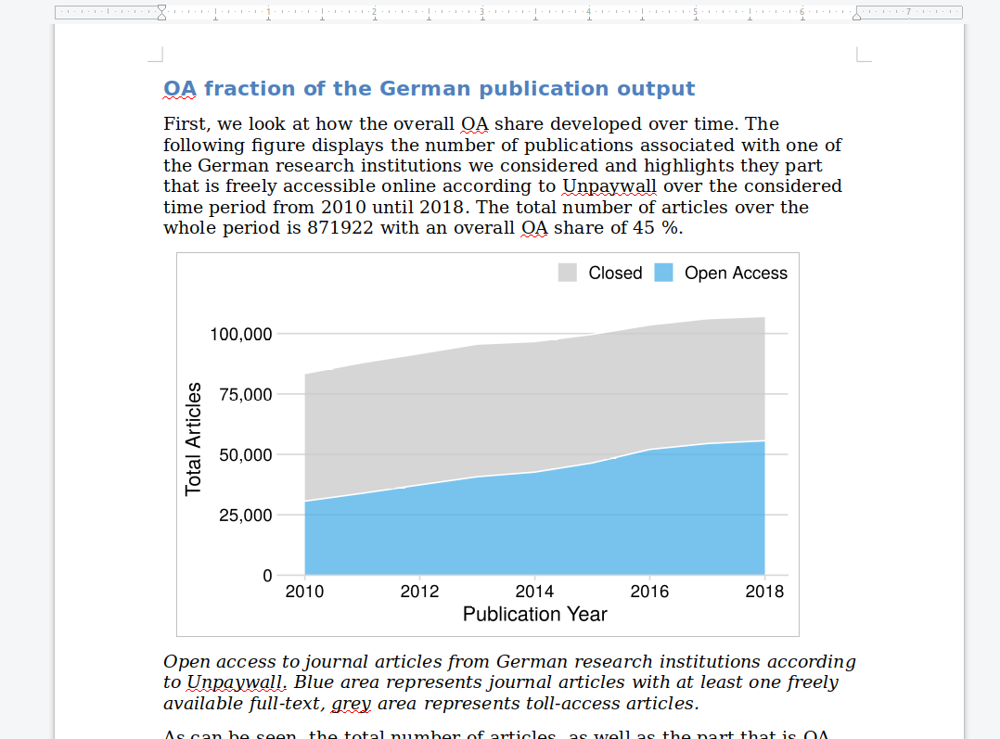

```{r setup, include=FALSE}
knitr::opts_chunk$set(echo = FALSE)
library(palmerpenguins)
library(tidyverse)
```

## What is RMarkdown (for)?

- Authoring framework for data science.
- File format (.Rmd) for making dynamic documents with R.
- A computational document.
- Tool for integrating text, code, and results.
- Compose
  - Lab Books/Notes/Exploration documents
  - Manuscripts for publication
  - Presentations
  - Teaching materials
  - Interactive papers and data apps (shiny)
  
## How does the output look like? - Blog

https://subugoe.github.io/scholcomm_analytics/

{width=70%}

## How does the output look like? - Code embedded in text



## How does the output look like? - pdf

{width=100%}

## How does the output look like? - Word

{width=95%}

## Components of a RMarkdown document

- YAML header (metadata)
- Text
- Inline code
- Code chunks

## YAML header

General:
```{r, eval=FALSE, echo=TRUE}
---
key: value
---
```

Usually looks something like:

```{r, eval=FALSE, echo = TRUE}
---
title: "This is the title"
author: "Name of the author"
output: html_document
---
```

## Text

Text uses Markdown syntax.

### Headers
```{}
# Header 1 / Title

## Header 2

### Header 3
```

### Emphasis

Text between asterisks (`*italics*`) will appear in *italics*,  
text between double asterisks (`**bold**`) will appear **bold**.

## Code

### Inline Code
Code snippets can be integrated in text passages using a pair of backticks `` `r ` ``, for example `` `r "\u0060r 1 + 2 \u0060"` `` will be evaluated and the result printed out as part of the text, namely `r 1+2`.

### Code chunks

<div style="float: left; width: 45%;">
````markdown
`r ''````{r}
 penguins %>% 
  distinct(species)
```
````
</div>

<div style="float: right; width: 45%;">
```{r, eval=FALSE, echo=TRUE}
penguins %>% 
  dinstinct(species)
## # A tibble: 3 x 1
##   species  
##   <fct>    
## 1 Adelie   
## 2 Gentoo   
## 3 Chinstrap
```
</div>

## More

There are other options, e.g.:

- Generating lists
- Creating Tables
- Including links
- Displaying images
- ...

Let's explore while writing an actual RMarkdown document!

## Helpful resources

- RMarkdown documentation https://rmarkdown.rstudio.com/
- Cheat sheet https://rmarkdown.rstudio.com/lesson-15.html
- Markdown tutorial https://commonmark.org/help/tutorial/
- Detailed RMarkdown course https://apreshill.github.io/rmd4cdc/ (a bit lenghty but entertaining)

